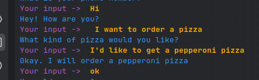
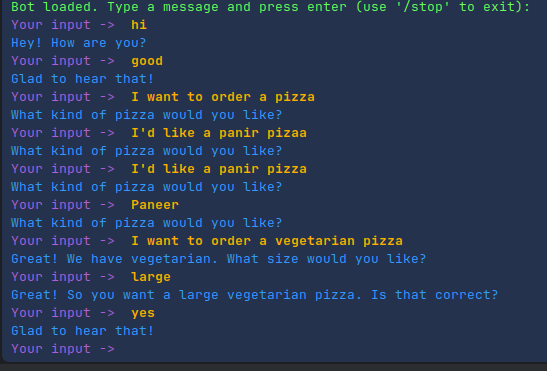

# Install Python Version 3.9
## use conda to create venv and install python 3.9
```bash
    conda create -p ./env python=3.9 -y
    conda activate ./env
```
## Install Required Libraries
```bash
    pip install -r requirements.txt
```

## Follow below setps for setup Rasa

1. Install Required Python Packages
2. Init Rasa by running the following command: `rasa init`
3. For inital setup say Y to all the options
4. Train the Rasa model by running the following command: `rasa train`
5. Start the Rasa server by running the following command: `rasa run`
6. Start the Rasa action server by running the following command: `rasa run actions`
7. Start the Rasa interactive learning session by running the following command: `rasa interactive`
8. Start the Rasa shell by running the following command: `rasa shell`
9. Start the Rasa server and action server by running the following command: `rasa run -m models --enable-api --cors "*" --debug`

### Rasa Basic File Structure and Use
```bash
    ├── actions
    │   ├── actions.py
    ├── data
    │   ├── nlu.yml
    │   ├── rules.yml
    │   ├── stories.yml
    ├── domain.yml
    ├── endpoints.yml
    ├── config.yml
    ├── credentials.yml
    ├── models
    │   ├── <timestamp>.tar.gz
    ├── tests
    │   ├── test_stories.yml
    ├── .gitignore
    ├── README.md
```

### Use of Rasa Files
1. **actions/actions.py** : This file contains the custom actions that the bot can perform. These actions can be used to fetch data from APIs, databases, or other sources, and to perform other tasks.
2. **data/nlu.yml** : This file contains the training data for the NLU model. It includes examples of user messages and the intents and entities they correspond to.
3. **data/rules.yml** : This file contains the rules that define the dialogue flow of the bot. Rules are used to define specific paths through the conversation based on user input.
4. **data/stories.yml** : This file contains example conversations between the user and the bot. These conversations are used to train the dialogue management model.
5. **domain.yml** : This file contains the domain configuration for the bot. It includes the intents, entities, actions, responses, and other elements that define the bot's behavior.
6. **endpoints.yml** : This file contains the configuration for the endpoints that the bot will use, such as the Rasa server and action server.
7. **config.yml** : This file contains the configuration for the NLU and dialogue management models. It includes settings for the pipeline, policies, and other components of the models.
8. **credentials.yml** : This file contains the credentials for external services that the bot will use, such as APIs or databases.
9. **models/** : This directory contains the trained models that the bot will use to process user input and generate responses.
10. **tests/** : This directory contains test data and scripts for evaluating the performance of the bot.


### Use chatGPT to get sample data for files nlu.yml, rules.yml, stories.yml, domain.yml
## now train the model

### rasa validate
```bash
    rasa data validate
```

```bash
    rasa train
```
## Start the Rasa server
```bash
    rasa run
```

## Now Integrate Chatbot with UI
1. go to file credentials.yml and add below code
```bash
    rasa:
        url: "http://localhost:5005/api"
```

2. Now start the Rasa server and action server
```bash
    rasa run -m models --enable-api --cors "*" --debug
    rasa run actions
```


# Example Usecase of RASA

1. open nlu.yml fileand add below in file
```aiignore
- intent: order_pizza
  examples: |
    - I want to order a pizza
    - I'd like to get a [pepperoni](pizza_type) pizza
    - Can I order a [vegetarian](pizza_type) pizza?
```

2. open domain.yml file and add below in file
```aiignore

responses:
  utter_ask_pizza_type:
    - text: "What kind of pizza would you like?"
  utter_slots_values:
    - text: "Okay. I will order a {pizza_type} pizza"

entities:
  - pizza_type
  slots:
    pizza_type:
      type: text
      influence_conversation: false
      mappings:
        - type: from_entity
          entity: pizza_type

intents:
    - greet
    - goodbye
    - order_pizza

actions:
     - utter_greet
     - utter_ask_pizza_type
     - utter_goodbye
     - utter_slots_values
```

3. Create Stories in stories.yml file
```aiignore
stories:
- story: happy path
  steps:
  - intent: greet
  - action: utter_greet
  - intent: order_pizza
    entities:
    - pizza_type: pepperoni # Correct way to define entities
  - slot_was_set:
    - pizza_type: pepperoni
  - action: utter_slots_values
  - intent: goodbye
  - action: utter_goodbye

- story: order pizza
  steps:
  - intent: greet
  - action: utter_greet
  - intent: order_pizza
  - action: utter_ask_pizza_type
  - intent: order_pizza
    entities:
    - pizza_type: vegetarian # Correct way to define entities
  - slot_was_set:
    - pizza_type: vegetarian
  - action: utter_slots_values
  - intent: goodbye
  - action: utter_goodbye
```

4. Train the model
```bash
    rasa train
```

5. Start the Rasa server
```bash
    rasa shell
```

6. Now you can test the chatbot by typing the messages in the shell and ask them
 

# Rasa Custom Actions Example

### Now in the commit mesaaeg you will see that i added chnages in files for below


